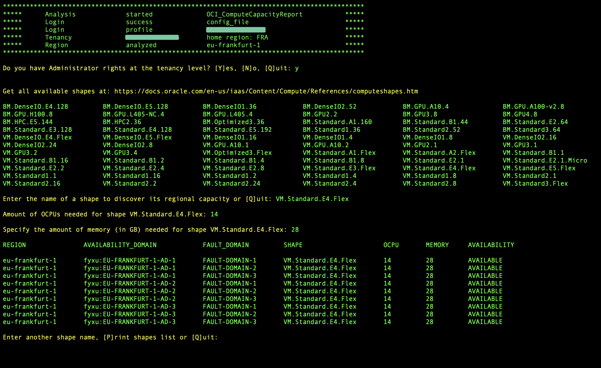

# OCI_ComputeCapacityReport

This script will display a report of the host capacity within an availability domain that is available for you to create compute instances. 
Host capacity is the physical infrastructure that resources such as compute instances run on.

Using this script you will be able to identify which region is offering last compute shape such as VM.Standard.E5.Flex

Script returns :
- AVAILABITY = AVAILABLE => the shape is available in the region/AD/FD
- AVAILABITY = HARDWARE_NOT_SUPPORTED => the shape has not yet been deployed in this region/AD/FD
- AVAILABITY = OUT_OF_HOST_CAPACITY => additional shapes are being deployed in the region/AD/FD

This script runs :

- within Oracle Cloud Infrastructure (OCI) CloudShell (Recommended method)
- on compute instance with instance_principals authentication
- on compute instance with config_file authentication


## Table of Contents

- [Prerequisite](#Prerequisite)
- [Parameters for execution](#Parameters-for-execution)
- [How to use](#How-to-use)
- [Setup](#Setup)
- [Screenshots](#Screenshots)
- [Disclaimer](#disclaimer)
- [Questions](#questions)

## Prerequisite:

You must pass a shape name as argument, the shape names are CASE SENSITIVE:
Please [review the shape names in the documentation](https://docs.oracle.com/en-us/iaas/Content/Compute/References/computeshapes.htm)

You can also pass a region name as argument if you don't want to analyze all the regions you subscribed:
Please [review the region identifier in the documentation](https://docs.oracle.com/en-us/iaas/Content/General/Concepts/regions.htm)

## Parameters for execution:

Default authentication uses [Instance Principals](https://docs.public.oneportal.content.oci.oraclecloud.com/en-us/iaas/Content/Identity/Tasks/callingservicesfrominstances.htm), meaning you can run this script from an OCI virtual machine without having to provide any details or credentials

| Argument      | Parameter            | Description                                                          |
| -----------   | -------------------- | -------------------------------------------------------------------- |
| -cs           |                      | authenticate through CloudShell Delegation Token                     | 
| -cf           |                      | authenticate through local OCI config_file                           | 
| -cfp          | config_file          | change OCI config_file path, default: ~/.oci/config                  | 
| -cp           | config_profile       | indicate config file section to use, default: DEFAULT                | 
| -rg           | region_identifier    | indicate OCI region to analyze, default: all_subscribed region		  | 
| -tcl          | target_compartmen    | indicate a specific compartment to analyze, default: ROOT            | 
| -shape        | shape_name           | indicate the shape name you want to analyze, default: NONE           | 

## How to use
##### Default :
	
	python3 ./OCI_ComputeCapacityReport.py -shape VM.Standard.E5.Flex

without authentication argument script tries to authenticate using Instance Principals

##### Authenticate with local_config_file:
	
	python3 ./OCI_ComputeCapacityReport.py -shape VM.Standard.E5.Flex -cf

##### Authenticate with custom local_config_file & profile:
	
	python3 ./OCI_ComputeCapacityReport.py -shape VM.Standard.E5.Flex -cf -cfp /home/opc/myconfig -cp MyDomain

##### Authenticate in cloud_shell:
	
	python3 ./OCI_ComputeCapacityReport.py -shape VM.Standard.E5.Flex -cs

##### Analyze a single region:
	
	python3 ./OCI_ComputeCapacityReport.py -shape VM.Standard.E5.Flex -rg eu-frankfurt-1	

# Setup

If you run this script from an OCI compute instance you should use the default authentication method: [Instance Principals](https://docs.public.oneportal.content.oci.oraclecloud.com/en-us/iaas/Content/Identity/Tasks/callingservicesfrominstances.htm).

Using Instance Principals, you must create the following resources:

##### Create a Dynamic Group

- Create a Dynamic Group called OCI_Scripting and add the OCID of your instance to the group, using :

```
ANY {instance.id = 'OCID_of_your_Compute_Instance'}
```	

##### Create a Policy

- Create a policy in the root compartment, giving your dynamic group the permissions to read resources in tenancy:

```
allow dynamic-group 'Your_Identity_Domain_Name'/'OCI_Scripting' to read all_resources in tenancy
```

##### Download script locally

```
git clone https://github.com/Olygo/OCI_ComputeCapacityReport
```

# Screenshots

##### Check where VM.Standard.E5.Flex is available :


##### Check where BM.DenseIO.E4.128 is available :


## Questions ?
**_olygo.git@gmail.com_**

## Disclaimer
**Please test properly on test resources, before using it on production resources to prevent unwanted outages or unwanted bills.**
