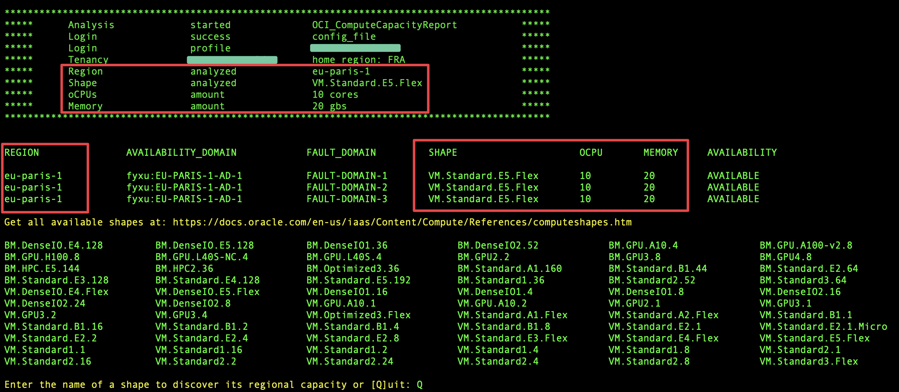
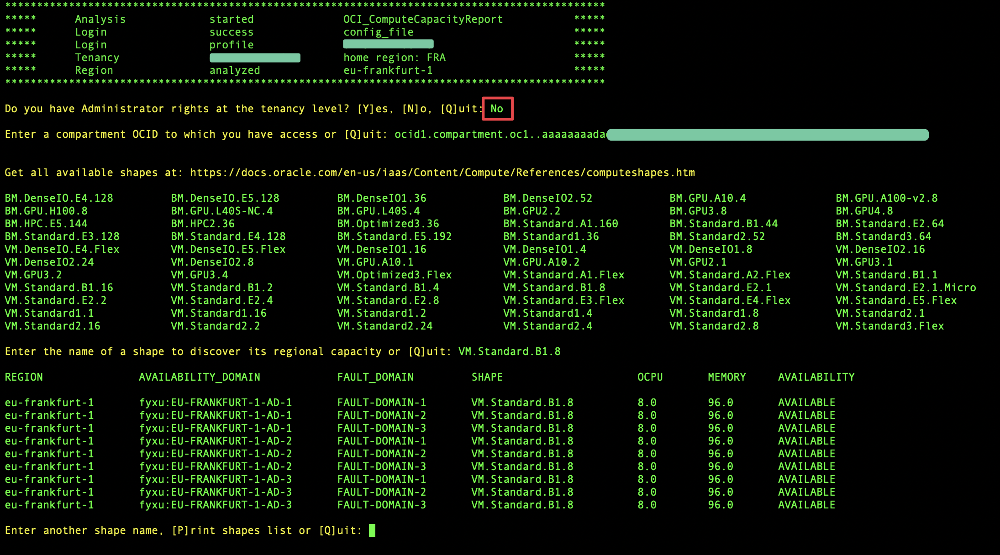

# OCI_ComputeCapacityReport

**version: 3.0.0**

**Check the Availability of Any Compute Shape Across OCI Regions !**

Easily find out which regions offer the latest compute shapes, such as VM.Standard.E5.Flex.

OCI_ComputeCapacityReport provides the availability status down to the Fault Domain level and automatically relaunches after completing the first query or encountering an error.

Output meanings are:

- **AVAILABLE** => The capacity for the specified shape is currently available.
- **HARDWARE_NOT_SUPPORTED** => The necessary hardware has not yet been deployed in this region.
- **OUT_OF_HOST_CAPACITY** => Additional hardware is currently being deployed in this region

## Table of Contents

- [How to use OCI_ComputeCapacityReport ?](### How-to-use-OCI_ComputeCapacityReport-?)
- [Script options](#Script-options)
- [Optional parameters for execution](#Optional-parameters-for-execution)
- [Examples of Usage](#Examples-of-Usage)
- [Setup](#Setup)
- [Screenshots](#Screenshots)
- [Compute Shapes Tested and Validated](#Compute-Shapes-Tested-and-Validated-as-of-September-1,-2024)
- [Questions and Feedbacks](#Questions-and-Feedbacks-?)
- [Disclaimer](#Disclaimer)
 
## How to use OCI_ComputeCapacityReport ?

	python3 ./OCI_ComputeCapacityReport.py


When no arguments are provided, OCI_ComputeCapacityReport **automatically**:

- Attempts to authenticate using all available authentication methods:

    1- CloudShell authentication
    
    2- Config_File authentication
    
    3- Instance_Principal authentication

    4- If all authentication fail, prompts the user to provide a config_file custom path and a config_profile section.

- Selects the tenancy's Home Region
- Asks if the user is a tenancy Admin
	- If user is not a tenancy Admin, asks for a compartment OCID
	- Using -su option will bypass this question
- Displays available [compute shape names](https://docs.oracle.com/en-us/iaas/Content/Compute/References/computeshapes.htm)
- Asks user to enter a compute shape name


## Script options:

OCI_ComputeCapacityReport can be fully automated using the following arguments:

- Enforce an authentication method, **-auth cs** | **cf** | **ip**
- Tenant administrators can bypass the 'Admin question' using **-su**
- Non-admin users can specify their own compartment ocid **-comp ocid1.xxxx**
- Select a specific subscribed region instead of the home region **-region eu-frankfurt-1**
- Target all subscribed regions **-region all_regions**
- Specify a shape name **-shape VM.Standard.E5.Flex**
- Optionally define oCPUs and memory amount **-ocpus 10** **-memory 30**

**OCI_ComputeCapacityReport** ensures the correct oCPU-to-memory ratio for each shape type. 
If an invalid configuration is entered, such as requesting 10 oCPUs with only 2 GB of memory, 
it automatically adjusts the values to meet the required specifications. 
Similarly, it enforces both the minimum and maximum limits for oCPUs and memory based on the shape type.

## Optional parameters for execution:

| Argument      | Parameter            | Description                                                                                        |
| -----------   | -------------------- | -------------------------------------------------------------------------------------------------- |
| -auth         | auth_method          | Force an authentication method : 'cs' (cloudshell), 'cf' (config file), 'ip' (instance principals) | 
| -config_file  | config_file_path     | Path to your OCI config file, default: '~/.oci/config'                                             |
| -profile      | config_profile       | Config file section to use, default: 'DEFAULT'                                                     | 
| -su           |                      | Notify the script that you have tenancy-level admin rights to prevent prompting                    | 
| -comp         | compartment_ocid     | Filter on a compartment when you do not have Admin rights at the tenancy level                     | 
| -region       | region_name          | Region name to analyze, e.g. "eu-frankfurt-1" or "all_regions", default: 'home_region'             | 
| -shape        | shape_name           | Compute shape name you want to analyze                                                             | 
| -ocpus        | integer              | Specify a particular amount of oCPU                                                                | 
| -memory       | integer              | Specify a particular amount of memory                                                              | 

## Examples of Usage
##### Default :
	
	python3 ./OCI_ComputeCapacityReport.py

try all authentication methods, check capacity in the Home Region only and prompt user to get a compute shape name

##### Authenticate using a config_file stored in a custom location:
	
	python3 ./OCI_ComputeCapacityReport.py -auth cf -config_file /path/to/config_file 

##### Select a subscribed region other than the Home Region:
	
	python3 ./OCI_ComputeCapacityReport.py -region eu-paris-1

##### Select all subscribed regions:
	
	python3 ./OCI_ComputeCapacityReport.py -region all_regions	

# Setup

##### Download script locally

```
python3 -m pip install oci -U --user
git clone https://github.com/Olygo/OCI_ComputeCapacityReport
```

If you run this script from an OCI compute instance you should use [Instance Principal authentication](https://docs.public.oneportal.content.oci.oraclecloud.com/en-us/iaas/Content/Identity/Tasks/callingservicesfrominstances.htm).

When using Instance Principal authentication, you need to create the following resources:

##### Dynamic Group

- Create a Dynamic Group called OCI_Scripting and add the OCID of your instance to the group, using :

```
ANY {instance.id = 'OCID_of_your_Compute_Instance'}
```	

##### Policy

- Create a policy in the root compartment, giving your dynamic group the permissions to read resources in tenancy:

```
allow dynamic-group 'Your_Identity_Domain_Name'/'OCI_Scripting' to read all_resources in tenancy
```

# Screenshots

##### Default run, prompt user for a compute shape name :


##### Support of Flexible DenseIO compute shapes :


##### Run script with parameters :
```
python3 ./OCI_ComputeCapacityReport.py \
-auth cf \
-config_file ~/Documents/config/my_config \
-profile OCI_FBO \
-shape VM.Standard.E5.Flex \
-ocpus 10 \
-memory 20 \
-region eu-paris-1 \
-su
```


##### Run script without tenancy admin rights :


## Compute Shapes Tested and Validated as of September 1, 2024

This list includes all the compute shapes that have been tested with this script. 
However, it does not represent the only shapes you can use. 
If a new compute shape is released and isn't included in this list, it should still work correctly. 
If you encounter any issues, please let me know.

|                     |                      |                        |                       |
| ------------------- | -------------------- | ---------------------- | --------------------- |
| BM.DenseIO1.36      | BM.DenseIO2.52       | BM.DenseIO.E4.128      | BM.DenseIO.E5.128     |   
| BM.GPU2.2           | BM.GPU3.8            | BM.GPU4.8              | BM.GPU.A10.4          |
| BM.GPU.A100-v2.8.   | BM.GPU.H100.8        | BM.GPU.L40S.4          | BM.HPC2.36            |
| BM.HPC.E5.144       | BM.Optimized3.36     | BM.Standard1.36        | BM.Standard2.52       |
| BM.Standard3.64     | BM.Standard.A1.160   | BM.Standard.B1.44      | BM.Standard.E2.64     |
| BM.Standard.E3.128  | BM.Standard.E4.128   | BM.Standard.E5.192     | VM.DenseIO1.16        |
| VM.DenseIO1.4	      | VM.DenseIO1.8        | VM.DenseIO2.16         | VM.DenseIO2.24.       |
| VM.DenseIO2.8	      | VM.DenseIO.E4.Flex   | VM.DenseIO.E5.Flex     | VM.GPU2.1             |
| VM.GPU3.1           | VM.GPU3.2            | VM.GPU3.4              | VM.GPU.A10.1          |
| VM.GPU.A10.2	      | VM.Optimized3.Flex.  | VM.Standard1.1         | VM.Standard1.16       |
| VM.Standard1.2      | VM.Standard1.4       | VM.Standard1.8         | VM.Standard2.1.       |
| VM.Standard2.16     | VM.Standard2.2       | VM.Standard2.24        | VM.Standard2.4        |
| VM.Standard2.8      | VM.Standard3.Flex    | VM.Standard.A1.Flex    | VM.Standard.A2.Flex   |
| VM.Standard.B1.1    | VM.Standard.B1.16    | VM.Standard.B1.2.      | VM.Standard.B1.4      |
| VM.Standard.B1.8    | VM.Standard.E2.1     | VM.Standard.E2.1.Micro | VM.Standard.E2.2      |
| VM.Standard.E2.4    | VM.Standard.E2.8     | VM.Standard.E3.Flex    | VM.Standard.E4.Flex   |
| VM.Standard.E5.Flex |	

## Questions and Feedbacks ?
**_olygo.git@gmail.com_**

## Disclaimer
**Always ensure thorough testing of any script on test resources prior to deployment in a production environment to avoid potential outages or unexpected costs. The OCI_ComputeCapacityReport script does not interact with or create any resources in your existing environment.**

**This script is an independent tool developed by Florian Bonneville and is not affiliated with or supported by Oracle. 
It is provided as-is and without any warranty or official endorsement from Oracle**
